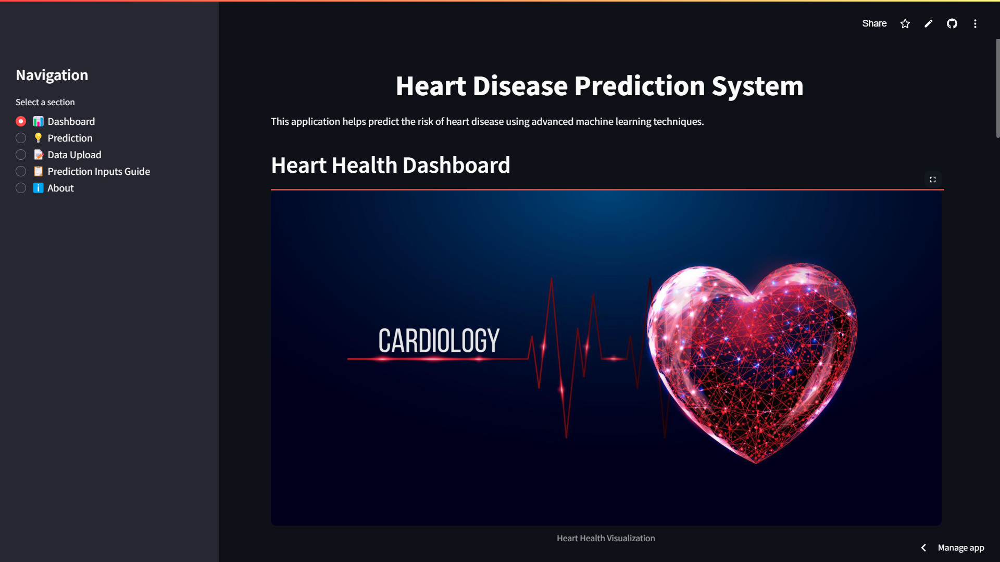

# Heart Disease Prediction System



The Heart Disease Prediction System is an interactive web application built with Streamlit that leverages machine learning to predict the risk of heart disease. By utilizing historical patient data and advanced ML techniques, the application provides users with accurate risk assessments and insightful visualizations. Designed with a user-friendly interface, this tool aims to make heart health insights accessible to individuals regardless of their medical expertise.

## Table of Contents
- Features
- Installation
- Usage
- Datasets
- Machine Learning Model
- Visualizations
- Prediction
- Input Guide
- About
- Contributing
- Contact
- Disclaimer

## Features
- **Data Loading and Processing:** Seamlessly load and process heart disease datasets from multiple sources, with support for custom dataset uploads.
- **Machine Learning Model:** Train a robust ML model using a pipeline featuring data scaling, PCA, and an ensemble classifier for accurate predictions.
- **Interactive Dashboard:** Explore data through a variety of visualizations, including prediction distributions, scatter plots, and performance metrics.
- **User-Friendly Prediction Interface:** Input personal health metrics to receive an instant risk assessment, complete with audio and visual feedback.
- **Detailed Input Guide:** Access explanations for each health metric to ensure accurate data entry.
- **Comprehensive About Section:** Learn about the project’s purpose, technologies, and contribution opportunities.

## Installation

Follow these steps to set up and run the application locally:

### Clone the Repository:
```bash
git clone https://github.com/yourusername/heart-disease-prediction.git
cd heart-disease-prediction
```

### Set Up a Virtual Environment (Optional but recommended):
```bash
python -m venv venv
source venv/bin/activate  # On Windows: venv\Scripts\activate
```

### Install Dependencies:
Ensure Python 3.8+ is installed, then install the required libraries:
```bash
pip install -r requirements.txt
```

### Launch the Application:
```bash
streamlit run app.py
```

### Access the App:
Open your web browser and go to http://localhost:8501.

## Usage

### Start the Application:
Execute the Streamlit command provided in the installation steps.

### Navigate the Interface:
- **📊 Dashboard:** View interactive visualizations of the data and model insights.
- **💡 Prediction:** Enter health metrics to get a heart disease risk prediction.
- **📝 Data Upload:** Load default datasets or upload your own CSV file.
- **📋 Prediction Inputs Guide:** Review detailed descriptions of input parameters.
- **ℹ️ About:** Learn more about the project and its development.

### Load Data:
Use the Data Upload section to load default datasets or your own CSV file.
- Required columns: `age, sex, cp, trestbps, chol, fbs, restecg, thalach, exang, oldpeak, slope, ca, thal, target.`

### Train the Model:
After loading data, select "Process with PCA and Train Model" to initiate training.

### Make Predictions:
In the Prediction section, input your health metrics and click "Predict Risk" for an assessment.

### Explore Insights:
Use the Dashboard to filter data and interact with visualizations for deeper understanding.

## Datasets

The application uses four heart disease datasets sourced from the UCI Machine Learning Repository:

- **Cleveland**
- **Switzerland**
- **Hungary**
- **VA Long Beach**

These datasets include 13 health metrics per patient and a target variable indicating heart disease presence. They are combined to form a robust training set for the machine learning model.

## Machine Learning Model

The prediction model employs a sophisticated pipeline:
- **Data Scaling:** Standardizes features for consistency.
- **PCA (Principal Component Analysis):** Reduces dimensionality while preserving 95% of variance.
- **Ensemble Classifier:** Integrates Random Forest and Gradient Boosting with soft voting for improved accuracy.

The model is trained on 80% of the data and validated on the remaining 20%, enabling reliable predictions for new inputs with probability scores.

## Visualizations

The Dashboard provides an array of interactive plots:
- **Prediction Distribution:** Bar and pie charts of risk predictions.
- **Age vs Maximum Heart Rate:** Scatter plot with trendlines showing risk correlations.
- **Cholesterol Distribution:** Box plots by risk category.
- **Correlation Heatmap:** Feature correlation visualization.
- **PCA Visualization:** 2D scatter plot of PCA-transformed data.
- **Source Comparison:** Histograms and box plots across datasets.
- **Feature Distributions:** Histograms of key metrics by source.
- **Model Performance:** Includes confusion matrix, ROC curve, feature importance, and classification report.

These visualizations offer intuitive insights into the data and model behavior.

## Prediction

The Prediction section allows users to:
- **Input Health Metrics:** Provide values for age, sex, chest pain type, etc.
- **Receive Assessment:** Get a "Low Risk" or "High Risk" result with a probability score.
- **Feedback:** Experience audio cues and animations (e.g., heartbeat for high risk, balloons for low risk).

## Input Guide

The Prediction Inputs Guide offers:
- **Definition:** What each metric means.
- **Relevance:** Its importance to heart disease.
- **Guidance:** How to measure or estimate it.
- **Examples:** Practical illustrations.

This ensures users can confidently provide accurate inputs.

## About

- **Purpose:** To democratize heart health insights using AI and real data.
- **Technologies:** Python, Streamlit, Scikit-learn, Pandas, NumPy, Matplotlib, Seaborn, Plotly.
- **Creator:** Manish, a developer focused on impactful technology solutions.
- **Contact:** See the Contact section below.

## Contributing

We welcome contributions! To get involved:
1. Fork the repository.
2. Create a branch for your changes.
3. Submit a pull request with a clear description of your contribution.

Please adhere to the project’s coding standards and include relevant tests.

## Contact

For inquiries or collaboration:
- **GitHub:** [rixscx](https://github.com/rixscx)
- **Email:** manishp.73codestop@gmail.com

## Disclaimer

This application is for educational purposes only and does not constitute medical advice. It is not a substitute for professional healthcare services. Consult a medical professional for accurate diagnosis and treatment recommendations.

## Guidance
This project incorporates insights from Victor Ikechukwu, an ML researcher. Special thanks to his work on [50-Days-of-Python](https://github.com/Victor-Ikechukwu/50-Days-of-Python) for inspiring parts of our Python implementation.
